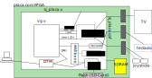

# SHIN_JAMMA padrão de placa FPGA versão 1.1

## Arquivos

Enquanto na versão 1.0 a proposta era gerar os arquivos necessários, na versão
1.1 todos os arquivos são criados manualmente. Em versões futuras a geração
automática de arquivos será retomada.

Uma placa de FPGA com nome "placa" terá um arquivo **sj_placa.v** com toda a lógia
de adaptação. O bloco de mais alto nível do videogame se chama "vg" em um arquivo
**vg.v** e deve incluir todos os pinos definidos abaixo. O bloco "vg" pode ligar
qualquer saída que não precisar a 0 e deixar qualquer entrada que não precisar
sem ligar a nada. Os pinos do bloco "vg" terminam em "_i" para entradas e "_o"
para as saídas.

Um arquivo **sj_placa.qsf** ou equivalente serve para associar os pinos do módulo
"sj_placa" do arquivo **sj_placa.v** aos pinos físicos da FPGA.

## Pinos do Sistema

clock50MHz_i, resetn_i

## Pinos de Audio e Vídeo

a_left_o[15:0], a_right_o[15:0], a_clk_o

v_r_o[9:0], v_g_o[9:0], v_b_o[9:0], v_vs_o, v_hs_o, v_clk_o

v_x_o[11:0], v_y_o[11:0], v_de_o

## Pinos dos Jogadores

p1_select_i, p1_start_i, p1_up_i, p1_down_i, p1_left_i, p1_right_i, p1_button1_i, p1_button2_i, p1_button3_i, p1_button4_i, p1_button5_i, p1_button6_i

p2_select_i, p2_start_i, p2_up_i, p2_down_i, p2_left_i, p2_right_i, p2_button1_i, p2_button2_i, p2_button3_i, p2_button4_i, p2_button6_i, p2_button6_i

No caso de um mouse ou trackball os seguintes sinais são trocados: up->Ydir, down->Yclk, left->Xdir, right->Xclk

## Pinos de Entradas e Saídas Simples

switch_i[15:0], led_o[15:0], seg_o[63:0]

Até oito mostradores de 7 segments (8 segments quando o ponto decimal é levado
em conta) tem seus segmentos controlados individualmente. O número de bit é 8
vezes o número do digito (da direita para esquerda) mais o número do segmento.

## Pinos Wishbone

wb_adr_o[31:0], wb_dat_i[31:0], wb_dat_o[31:0], wb_we_o, wb_sel_o[3:0], wb_stb_o, wb_ack_i, wb_cyc_o

O Shin JAMMA 1.1 pode implementar acesso à memória externa à FPGA e até 15 periféricos
com uma inteface Wishbone Mestre B4 no bloco "vg" usando o seguinte mapa de memória:

| início     | fim        | interface |
|------------|------------|-----------|
| 0x00000000 | 0xEFFFFFFF | Memória Externa |
| 0xF0000000 | 0xF0FFFFFF | Teclado |
| 0xF1000000 | 0xF1FFFFFF | Sistema de Arquivos |
| 0xF2000000 | 0xF2FFFFFF | interface 2 |
| ...        | ...        | ...         |
| 0xFF000000 | 0xFFFFFFFF | inteface 15 |

Apenas escritas e leituras simples são implementadas e apenas os dois primeiros
periféricos estão definidos abaixo.

### Memória Externa

Uma ou mais memórias externas podem ser mapeadas no espaço de 4.026.531.840 bytes.
Note que controladores de memória SDRAM, especialmente DDR, podem ser bem complexos.
Por outro lado algumas FPGAs implementam tais controladores usando blocos dedicados.

### Teclado

A leitura deste periférico retorna o próximo caracter pendente ou 0 se a fila estiver
vazia.

### Sistema de Arquivos

A ser definido. Uma possibilidade é expor os comands do cartão SD. Outra é implementar uma interface de mais alto nível como dos microcomputadores de 8 bits com unidades de disquetes inteligentes (Atari e Commodore).

## Interface de Depuração

dmi_req_valid_i, dmi_req_ready_o, dmi_req_address_i[6:0], dmi_req_data_i[31:0], dmi_req_op_i[1:0], dmi_rsp_valid_o, dmi_rsp_ready_i, dmi_rsp_data_o[31:0], dmi_rsp_op_o[1:0]

Implementa os sinais sugeridos no padrão de teste externo RISC-V 1.0-STABLE A.3
com um módulo DM (Debug Module) dentro do bloco "vg" e um módulo DTM (Debug
Transport Module) no módulo "sj_placa".
